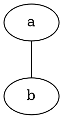

# discourse-graphviz-theme-component

A theme component to use Graphviz on your discourse instance

## Usage

Can be used in posts or chat messages:

````

````

## Updating

The Graphviz source code comes from the amazin repository: https://github.com/hpcc-systems/hpcc-js-wasm
